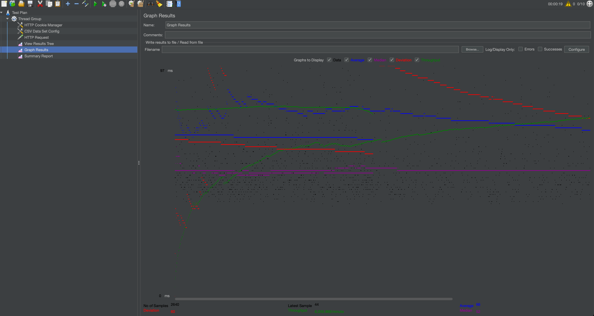
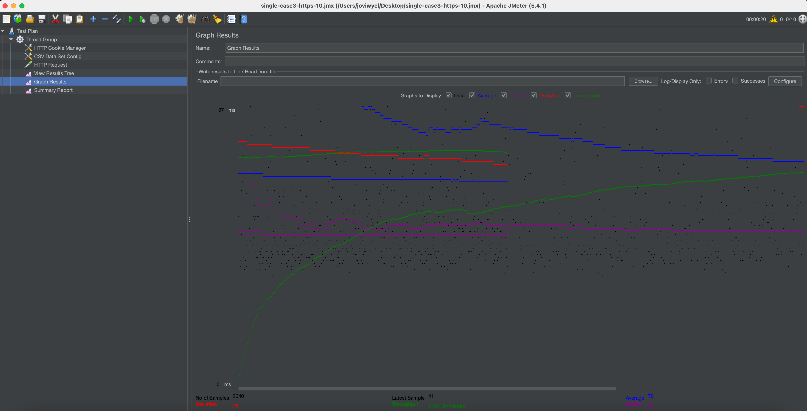
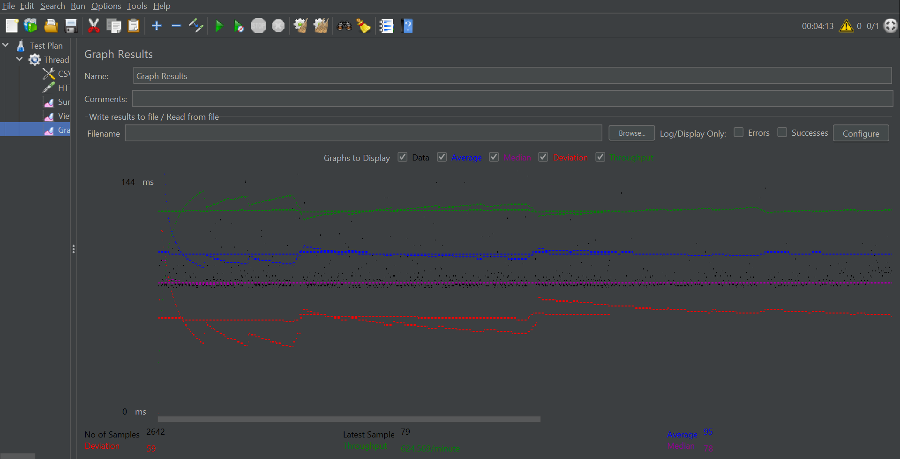

## CS 122B Spring 2021 Team10

Important notes: 
  For the whole project, there are two contributers, do some clarify about their commit name. 

Committer name "Kai Li Tan", "kaiiiliii" are made by member Kai Li Tan, who is using Github Username "kaiiiliii".

Committer name "Jovi Wyel", "Jing Wu", "joviwyel" are made by member Jing Wu, who is using Github Username "joviwyel".

# General
   ## Team#:  Team-10
    
   ## Names: Kai Li Tan, Jing Wu
    
   ## Project 5 Video Demo Link: https://youtu.be/-keHJVjK88I

   ## Instruction of deployment:

  You can either use gui to deploy war file into Tomcat or do it in Terminal. By gui: Go to AWS Tomcat manager webapp -> WAR file to delpoy -> Choose File and deploy.

Use Terminal:

Inside your repo, use 'mvn package' to build the war file.
Copy war file into Tomcat webapps folder `cp ./target/*.war /var/lib/tomcat9/webapps/`
After that, Tomcat web apps should have the new war file "css122b-spring21-team-10-p1".

   ## Collaborations and Work Distribution:
   
   Both member created all 5 instances, did all Single version and Scaled version JMeter test.

# Connection Pooling

   ## Include the filename/path of all code/configuration files in GitHub of using JDBC Connection Pooling.
   * [BrowsServlet](src/BrowsServlet.java)
   * [CartServlet](src/CartServlet.java)
   * [CreditCardServlet](src/CreditCardServlet.java)
   * [DashboardServlet](src/DashboardServlet.java)
   * [LoginEmployeeServlet](src/LoginEmployeeServlet.java)
   * [LoginServlet](src/LoginServlet.java)
   * [MovieServlet](src/MovieServlet.java)
   * [SaleServlet](src/SaleServlet.java)
   * [SAXParserCasts](src/SAXParserCasts.java)
   * [SAXParserStars](src/SAXParserStars.java)
   * [SAXParserMovies](src/SAXParserMovies.java)
   * [SingleMovieServlet](src/SingleMovieServlet.java)
   * [SingleStarServlet](src/SingleStarServlet.java)
   * [TitleSuggestion](src/TitleSuggestion.java)
   * [UpdateSecureEmployeePassword](src/UpdateSecureEmployeePassword.java)
   * [UpdateSecurePassword](src/UpdateSecurePassword.java)
    
   ## Explain how Connection Pooling is utilized in the Fabflix code.
   
   * By using Connection Pooling we can reduce the time it takes by making a more secure connection. And all the information are stored in context.xml. By allocating set of connections in our `context.xml` we define our datasource with connection pooling. When we try to get connections, it takes a connection from the pool that is pre-created and does not need to be established again. After the connection is finished, we call `close()`, which does not close the connection but returned to the pool for future use.
    
   ## Explain how Connection Pooling works with two backend SQL.
   * For different backend database, create different connection pool which are master and slave. Depends on its purpose of connection, use different database. For read and write will use the master, the slave one for read only.
   
# Master/Slave

   ## Include the filename/path of all code/configuration files in GitHub of routing queries to Master/Slave SQL.
   * [BrowsServlet](src/BrowsServlet.java)
   * [CartServlet](src/CartServlet.java)
   * [CreditCardServlet](src/CreditCardServlet.java)
   * [DashboardServlet](src/DashboardServlet.java)
   * [LoginEmployeeServlet](src/LoginEmployeeServlet.java)
   * [LoginServlet](src/LoginServlet.java)
   * [MovieServlet](src/MovieServlet.java)
   * [SaleServlet](src/SaleServlet.java)
   * [SAXParserCasts](src/SAXParserCasts.java)
   * [SAXParserStars](src/SAXParserStars.java)
   * [SAXParserMovies](src/SAXParserMovies.java)
   * [SingleMovieServlet](src/SingleMovieServlet.java)
   * [SingleStarServlet](src/SingleStarServlet.java)
   * [TitleSuggestion](src/TitleSuggestion.java)
   * [UpdateSecureEmployeePassword](src/UpdateSecureEmployeePassword.java)
   * [UpdateSecurePassword](src/UpdateSecurePassword.java)
   
   ## How read/write requests were routed to Master/Slave SQL?
   For read requests, the web server can send them to the Master and all the Slaves for reading records from the database because the contents are the same in all the machines assuming there is low latency. However, the write requests has to be sent from the web server to the Master only, in order to operate any insertion, deletion and update on the database. The changes will first be reflected on the Master, then the changes will propagate through the MySQL replication mechanism to the Slaves. The technique used here in the replication mechanism is logs which keeps track of all the changes received by the Master. For example, once the Master has made any read/write operations, the operations will be recorded in the Binary Logs in sequence. Then, the Binary Logs will be sent to the Slave through the propagation channel connected. After the Slave had received the log records and has own version of Relay Logs, it will replay the log records to apply the changes on its local database system. Given the condition where the initial databases for both Master and Slave are the same, then the final modified database systems for both will be identical after all the changes.
   
# JMeter TS/TJ Time Logs

   ## Instructions of how to use the `log_processing.*` script to process the JMeter logs.
   * Our [log_processing.py](log_processing.py) is a script written by python. It will read data from the log file and calculate the average TS and TJ by using the total value / the number of sample. Then it can print the avarage TS and TJ.
   ## Log files
  * [Single case 1](logs/single-case1-1.txt)
  * [Single case 2](logs/single-case2-10.txt)
  * [Single case 3](logs/single-case3-https-10.txt)
  * [Single case 4](logs/single-case4-nopooling.txt)
  * [Scaled case 1](logs/scaled-case1-1.txt)
  * [Scaled case 2](logs/scaled-case2-10.txt)
  * [Scaled case 3](logs/scaled-case3-10.txt)

# JMeter TS/TJ Time Measurement Report

| **Single-instance Version Test Plan**          | **Graph Results Screenshot** | **Average Query Time(ms)** | **Average Search Servlet Time(ms)** | **Average JDBC Time(ms)** | **Analysis** |
|------------------------------------------------|------------------------------|----------------------------|-------------------------------------|---------------------------|--------------|
| Case 1: HTTP/1 thread                          |    | 47                         | 4.4610323993186975                   | 4.28923294322483         | By using Connection pooling we got a really small TJ and TS time.           |
| Case 2: HTTP/10 threads                        |    | 66                        | 20.906926947348488                   |  19.30226718030303         | Compare to the 1 thread test, we noticed that 10 threads will cost much longer to get response.           |
| Case 3: HTTPS/10 threads                       |    | 70                         | 23.291292710984848                  | 21.579829289772725        | Compare to the HTTP test, HTTPS take longer than by using HTTP request.           |
| Case 4: HTTP/10 threads/No connection pooling  |    | 219                         | 167.5020525                                  | 27.306450941710825                        | Without Connection pooling which cost much longer than with Connection pooling cast. This shows that connection pooling can save the query time.           |

| **Scaled Version Test Plan**                   | **Graph Results Screenshot** | **Average Query Time(ms)** | **Average Search Servlet Time(ms)** | **Average JDBC Time(ms)** | **Analysis** |
|------------------------------------------------|------------------------------|----------------------------|-------------------------------------|---------------------------|--------------|
| Case 1: HTTP/1 thread                          |   | 95                          | 3.481594854                       | 3.109576045                        | ??           |
| Case 2: HTTP/10 threads                        |    | 94                        | 7.421240679              | 5.906030491                       | ??           |
| Case 3: HTTP/10 threads/No connection pooling  |    | 95                         | 6.578229258                                  | 4.629758364                        | ??           |

# Project 4

## Demo video URL: https://www.youtube.com/watch?v=B2ix-XbwzQ8

## Important notes for P4:
  Jing Wu, which use committer name as joviwyel, since main labtop is using Apple M1 chip and not support Android AVD, so was using friend's labtop doing Android app part. Then accidentally forgetting to modify committer. There was one commit under name "Jovi Wyel" which should be "joviwyel". Therefore, this project may have more than two committer. Please forgive me.

## Explanation of implementation of fuzzy search:
  Since for full-text search we set only work when input is >= 3 char, so we designed fuzzy search based on the following rule.
  
  1. For input length < 4, can't do fuzzy search.
  2. For input length < 5, can do fuzzy search which has difference length <= 1.
  3. For input length < 6, can do fuzzy search which has difference length <= 2.
  4. For longer length input, can do fuzzy search which has difference length <= 3.

## Instruction of Mobile App:

  1. Open a new project with FabFlixMovie in Android Studio
  3. Build and deploy APK on your local emulator
  4. Run locally

## Each member's contribution:

 Both members are get familiar with all the layers of this project. 
 
 Kai Li Tan mainly focus on task 2, Android App part, and do some contribute to task 1 such like Full-text Search and Autocomplete UI. 
 
 Jing Wu mainly focus on task 1 and 3, Full-text Search, Autocomplete and Fuzzy Search, and do some contribute to task 2 such like seach page of Android Search Page.
# Project 3

## Demo video URL:

https://youtu.be/wK0LpAKxWds

## Instruction of deployment:
  You can either use gui to deploy war file into Tomcat or do it in Terminal.
  By gui:
  Go to AWS Tomcat manager webapp -> WAR file to delpoy -> Choose File and deploy. 

  Use Terminal:
  1. Inside your repo, use 'mvn package' to build the war file.
  2. Copy war file into Tomcat webapps folder
    cp ./target/*.war /var/lib/tomcat9/webapps/
  
  After that, Tomcat web apps should have the new war file "css122b-spring21-team-10-p1".

## Queries with parameters from user input ('?') using Prepared Statement:
   1. [DashboardServlet](src/DashboardServlet.java) - line 107, 169, 200, 230, 238, 246.
   2. [SaleServlet](src/SaleServlet.java) - line 125.
   3. [SAXParserCasts](src/SAXParserCasts.java) - line 194.
   4. [SAXParserMovies](src/SAXParserMovies.java) - line 304, 329, 347, 369.
   5. [SAXParserStars](src/SAXParserStars.java) - line 203, 217.
   6. [SingleMovieServlet](src/SingleMovieServlet.java) - line 78.
   7. [SingleStarServlet](src/SingleStarServlet.java) - line 73.

## XML file insert time report:
  
  A file has been generated by program on AWS instance, named ParsingReport.txt.
  
  Parsing details as followed:

  Total insert Stars: 6527.
  
  Duplicates Stars found: 336.
  
  Total insert genre: 136.
  
  Total insert Movies: 12046.
  
  Found duplicate movies: 30.
  
  Ignored movies: 39.
  
  Total insert genre_in_movie: 8743.
  
  Ignored genre_in_movie: 3314.
  
  Total insert rating: 12046.
  
  Time in Seconds for Parser and insert for actors63.xml file is: 35.898.
  
  Time in Seconds for Parser and insert for mains243.xml file is: 20.099.
  
  Time in Seconds for Parser and insert for casts124.xml file is: 11.326.
  
  
## XML parsing optimization report:
  Except as mentioned in our project file such like set auto-commit off and using PreparedStatement methods, there are many other ways can be done to reduce the running time of our program. Here do some small describe about the method which our project is using. 
  
  Method One: (This project is using this method.)
  Since for project 3, we need to insert some new information into the old database. In order to do this, we have to check if the information we want to insert is already exists. Therefore, Our main approach is to reduce the time it takes to retrieve data already in the database. 
  1. We create an new Object to access and modify data easier. For movies, we have Object NewMovie, which will store all the data related to the Movie. For Stars, we have Object NewStar, which will store all the data telated to the Star. 

  2. We are using HashMap to store key and value. For table stars, movies, stars_in_movies, genres_in_movies and genres, we create bounch of HashMap to hold all the key and value for those information. For example, HashMap<NewMovie, String> moviesMap, this Hashmap has a key which is the Object NewMovie which include movie's title, year and director, and the value is movieId. Before parsing, we will create this HashMap. During the parsing time, we will create a new Object which include the information got from XML file, and check if this HashMap already contains such key. If not, then doing insert. HashMap will reach the key and value efficiently. Then significantly reduced running time.

  Method Two:
  Another method is to use load data infile statement. By using this, can read rows from a text file into a table in a short time. 
  
  Method Three:
  Use JDBC Bathc Statement processing to reduce the running time. Batch statement processing allows related SQL statements to be grouped into batches and committed in a single call to the database, and the interaction with the database completed in a single execution. Send multiple SQL statements to the database at once, can improve performance by reducing communication overhead.
  
## Each member's contribution:

Kai Li Tan: 
            
            1)Password Encryption 
            2)Prepared Statement 
            3)Employee Dashboard.

Jing Wu   :

            1)reCAPTCHA   
            2)HTTPS           
            3)XML Parsing.

# Project 2
## Demo video URL: https://www.youtube.com/watch?v=rE5Uz4C_JIo

## How to deploy this application with Tomcat:
You can either use gui to deploy war file into Tomcat or do it in Terminal.
By gui:
Go to AWS Tomcat manager webapp -> WAR file to delpoy -> Choose File and deploy. 

Use Terminal:
1. Inside your repo, use 'mvn package' to build the war file.
2. Copy war file into Tomcat webapps folder
  cp ./target/*.war /var/lib/tomcat9/webapps/
  
After that, Tomcat web apps should have the new war file "cs122b-spring21-team-10-p1".

## Substring matching design:
+ Our searching support substring matching searching. When user type in characters, will find all strings that contain the pattern anywhere. User don't need to type in any special characters. 
- For example, the movie "Dominator" can be search by 
  i) domina%
  ii) %mina%
  iii) %tor
 and many more combinations.
 
+ LIKE was used to search for a specified pattern in the Title, Director, and Star Name columns using the wildcards, '%'.
 - '%' represents zero or more characters.
 
+ 'ABC%': All strings that start with 'ABC'. E.g. 'ABCD' and 'ABCABC'.

+ '%XYZ': All strings that end with 'XYZ'. E.g. 'WXYZ' and 'ZZXYZ'.

+ '%AN%': All strings that contain the pattern 'AN' anywhere. E.g. 'LOS ANGELES' and 'SAN FRANCISCO'.

## Each mamber's contribution:

+ Task 1:
    - Jing Wu did Login page and Main page. For our main page is an nagvigation page to jump to Browsing and Searching.
    
+ Task 2: 
    - Kai Li Tan did Searching page.
    - Jing Wu did Browsing page.

+ Task 3:
    - Kai Li Tan did Movie List Page(Extended from Project 1) and related jump functionaly. 
    - Jing Wu did Single Movie Page(Extended from Project 1) and related jump functionaly.

+ Task 4:
    - Kai Li Tan did Payment Page, Place Order action.
    - Jing Wu did Shopping Cart Page, Add to Shopping Cart Button.

+ Kai Li Tan make the demo video for project 2.
+ Both members beautify the webpage and work report.  
    
+ The two of us communicated very timely, discussed, solved many difficult problems and fixed some bugs together. 

# Project 1
This is team10 project 1 final version. Team members developed team10 version of the project based on the api-example.

## Demo video URL:

https://youtu.be/i2CiywA60Yg

## Some briefly explain:

1. Movie List Page: Show top 20 rated movies include some detail informaiton(title, year, director, 3 genres, 3 stars, rating)

Have hyperlink for each movie and star.

2. Single Movie Page: Display title, year, director, all genres, all stars, rating for one movie.

Have hyperlink for each star.

3. Single Star Page: Show name, year of birth, all movies in which the star performed.

Have hyperlink for each movie.

4. Jump Functionality: We added button to Single Movie Page and Single Star Page which can jump back to Movie List Page.

5. All the data come from database 'moviedb'

## Each mamber's contribution:

1. First of all, both two members builed our own AWS, and setup MySQL, Tomcat and IDE on our local and AWS machine.

2. In order to better test and learn the entire project setup and build process, both members create database moviedb on our own local machine and AWS.

3. Contribution break down as follows:

Movie List Page:

*    Kai Li Tan: Added all the hyperlink for each stars and movie. Let page show top 20 rated movies.

*    Jing Wu: Added 3 genres and 3 stars on the page.

Single Movie Page:

* Kai Li Tan: Added display title, year, director, all genres, rating.

* Jing Wu: Added display all the stars. Added all the hyperlink for each stars.

Single Star Page:

* Kai Li Tan: Added display name, year, and birth.

* Jing Wu: Added all the hyperlink for each movie.

Jump Functionality:

* Kai Li Tan: Added all the buttons in the application.

Others:

* Kai Li Tan: Beautify the webpage. 

* Jing Wu: Make the demo video and work report.
